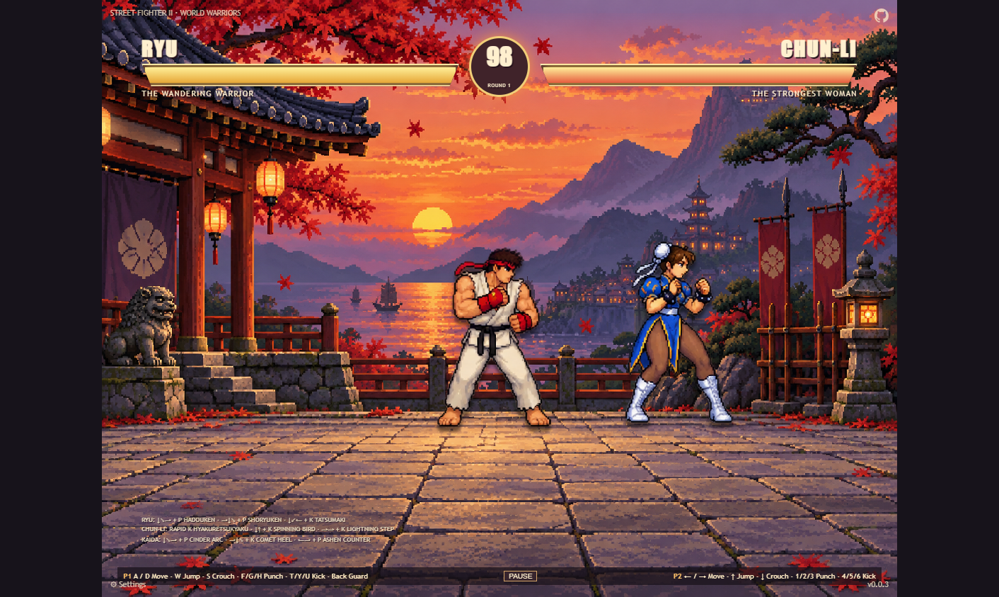
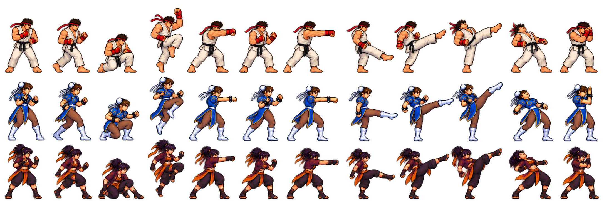
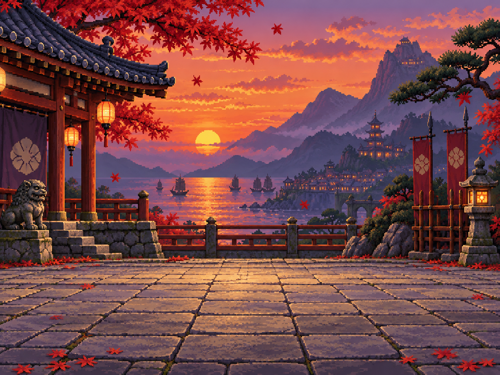

# Street Fighter II Clone — World Warriors

A browser arcade fighter inspired by the original *Street Fighter II: The World Warrior*, with three selectable fighters, local two-player play, and private online duels.

## Live Demo

- [Play the latest public playtest (v0.0.7)](https://samuelasherrivello.github.io/babylon-lite-street-fighter-clone/)
- [Release v0.0.7](https://github.com/SamuelAsherRivello/babylon-lite-street-fighter-clone/releases/tag/v0.0.7)

## Table of Contents

1. [Getting Started](#getting-started)
2. [How to Play](#how-to-play)
3. [Online Duels](#online-duels)
4. [Fighters and Moves](#fighters-and-moves)
5. [Artwork and References](#artwork-and-references)
6. [Technical Notes](#technical-notes)
7. [Release](#release)
8. [Original AI Prompt](#original-ai-prompt)
9. [Credits](#credits)

## Getting Started

Use Node.js 24 and npm from the repository root:

```sh
npm ci
npm run dev
```

Open the local URL printed by Vite. Choose **Start Game**, select fighters, and choose **Fight! — Local 2 Player**. Run `npm test` for gameplay and source checks, or `npm run build` for the production site bundle.

The game uses Babylon Lite and WebGPU. Use a current browser with WebGPU enabled. If the browser cannot initialize WebGPU, the game displays an explanatory message.

## How to Play

The match uses a fixed 4:3 landscape playfield. The layout stays landscape across desktop and mobile; narrow screens show the full playfield scaled to fit, with touch controls at the bottom.

A round lasts 99 seconds. A knockout wins the round; when time expires, the fighter with more health wins. Equal health and simultaneous knockouts draw. The first fighter to win two rounds wins the best-of-three match. Start a fresh match from the results screen.

### Keyboard

| Action | Player 1 | Player 2 (local mode) |
|---|---|---|
| Move left/right | A / D | ← / → |
| Jump / crouch | W / S | ↑ / ↓ |
| Guard | Hold away from opponent | Hold away from opponent |
| Light / medium / heavy punch | Y / U / I | 1 / 2 / 3 |
| Light / medium / heavy kick | J / K / L | 4 / 5 / 6 |
| Pause local match | Pause button | Pause button |

Direction for special moves is relative to the opponent. Back (away) also guards. Player 1's `WASD` and `YUI JKL` controls do not overlap the app's React shortcuts; Player 2 uses arrows and number keys.

Use the menu's **Sound** control and volume slider for music and effects. Add `?mute=1` to the game URL to force fully silent mode for browser automation and playtesting; the sound control remains disabled in that mode.

### Gamepad and Touch

Each connected gamepad uses its left stick or D-pad to move. Face buttons provide jump and punch, and the right-side buttons provide kick strengths. The same layout is available on the first gamepad during an online match. On narrow screens, use the on-screen directional pad and six attack buttons; hold more than one touch button at once for combined inputs. Releasing a touch or losing window focus clears held input.

## Online Duels

Choose **Online Duel** and create an invite. Share the six-character room code or use **Copy Invite Link**. Your opponent opens that link in another browser session or device and joins with the code. Both players select a fighter and ready up. Online combat, damage, timer, and match results are server authoritative.

Online controls use the **Player 1** keyboard/gamepad layout independently in each browser. Pause or focus loss sends neutral input for that player; it does not pause the shared fight. The client attempts to reclaim the same fighter seat for 15 seconds after a dropped connection. If the room process or hosting instance disappears, the invite and match can be lost because rooms and recovery tokens are in-memory. Create a new invite to play again.

The default backend is `https://rmc-colyseus-multiplayer-server.vercel.app`. Developers can set `VITE_MULTIPLAYER_SERVER_URL` in a local `.env` file to use another compatible endpoint. The client package is pinned to the released shared-server artifact in `package.json` and `package-lock.json`.

## Fighters and Moves

Move notation uses `↓` down, `→` toward the opponent, `←` away, `↘` down-toward, and `↙` down-away. Finish each command with the specified punch or kick. All fighters also have light, medium, and heavy punches and kicks.

| Fighter | Role | Special moves |
|---|---|---|
| Ryu | Balanced | Hadouken `↓ ↘ → + P`; Shoryuken `→ ↓ ↘ + P`; Tatsumaki `↓ ↙ ← + K` |
| Chun-Li | Speed | Hyakuretsukyaku (rapid K); Spinning Bird Kick `↓ ↑ + K`; Lightning Step `→ → + K` |
| Kaida | Trickster | Cinder Arc `↓ ↘ → + P`; Comet Heel `→ ↓ ↘ + K`; Ashen Counter `← → + P` |

Kaida is an original ember-comet martial artist with a counter-focused style. Specials have distinct damage, startup, active, recovery, range, hit/block stun and command inputs. Hyakuretsukyaku lands four rapid hits; Ashen Counter only connects while the opponent is attacking.

## Artwork and References

All game artwork is original and generated for this project. The fighter sprite sheet includes Ryu, Chun-Li, and original character Kaida, with standing, moving, crouching, jumping, three distinct punches and three distinct kicks, hit, and block poses. The three original stages are Sunset Dojo, Harbor Market, and Snow Temple. Local players choose a stage before the match; online rooms derive one stable stage from the invite code so both clients display the same scene. No game ROM, extracted arcade/SNES sprites, official logos, music, or sound effects are included. Arcade music and impact sounds are synthesized live in the browser from an original short note pattern; use **Sound** and the volume slider to control them.








Gameplay study: [playable SNES reference](https://www.retrogames.cz/play_304-SNES.php) and [Street Fighter II history and rules](https://en.wikipedia.org/wiki/Street_Fighter_II). Visual study: [Capcom's Street Fighter history](https://www.streetfighter.com/en/35th/history.html) and [Nintendo's SNES game page](https://www.nintendo.com/en-gb/Games/Super-Nintendo/Street-Fighter-II-The-World-Warrior-793127.html). These sources guide combat pacing, move identity, silhouette readability, HUD hierarchy, and stage atmosphere; they are not asset sources.

## Technical Notes

- React/Vite UI and match presentation live in `street-fighter-ii/src/`.
- Deterministic combat and fighter data are in `street-fighter-ii/src/game/` and are shared with the server release.
- Babylon Lite 1.32.0 renders the selected authored stage through WebGPU. Textures use nearest sampling, clamp-to-edge, no mipmaps, and one MSAA sample. The DPR-aware canvas presents the full 960×720 logical match in a fixed landscape viewport.
- Local combat advances on a fixed 60 Hz simulation clock. Online fighters render between recent server snapshots with a short interpolation delay; health, hits, and round outcomes remain authoritative server values.
- The app folder is `street-fighter-ii/`; Vite publishes its build from `street-fighter-ii/dist/` under the GitHub Pages repository path.
- The version source is `version.txt`.
- OpenSpec planning and implementation records are under `openspec/`.

## Release

The checked-in **Release** workflow runs `npm ci` and `npm test`, increments the patch in `version.txt`, tags and publishes a GitHub release. The Pages workflow builds and deploys the `main` branch to the live demo. Repository Actions must have GitHub Pages enabled for the configured `github-pages` environment.

## Original AI Prompt

Read the full original prompt (edited for grammar, punctuation, spelling, and formatting).

```text
$ai-skills-create-game

- Title: Street Fighter II Clone
- Type: Multiplayer, online competitive, 1v1 fighting game. Support local two-player play and online rooms using Colyseus.

- Delivery and milestones:
  - Build this as a faithful, playable clone of the original arcade game Street Fighter II: The World Warrior, using its side-view one-on-one format, round structure, iconic special-move inputs, and competitive feel as the gameplay reference.
  - Create a new game repository from the required template. Use Babylon Lite with WebGPU and publish the completed game to GitHub Pages.
  - Organize work into three consecutive OpenSpec proposals, one per milestone:
    1. Foundation
       - Establish the application structure, 2DPixelPerfect rendering, side-view stage, fighter selection, keyboard/gamepad controls, and testable combat rules.
       - Deliver a locally playable two-player foundation with movement, blocking, jumping, crouching, basic attacks, health, round timer, win/loss, and restart behavior.
    2. Multiplayer Setup
       - Extend, test, release, and verify the shared Colyseus server.
       - Integrate room creation and joining, shareable room codes, ready states, authoritative match state, synchronized combat, input handling, and reconnect behavior.
       - Deliver a deployed multiplayer build verified with two browser clients.
    3. Gameplay Polish
       - Complete all three characters' move sets, special moves, hit reactions, round and match flow, original artwork and audio, UI feedback, and responsive presentation.
       - Test combat timing, fairness, latency, jitter, recovery, and a complete best-of-three match. Fix issues found during browser playtesting.
       - Release and verify the final public demo.
  - Work through milestones sequentially. Finish and verify one milestone before creating the next proposal.
  - For each milestone, use OpenSpec explore to inspect the repositories and investigate choices and risks; OpenSpec propose to create focused design, requirements, acceptance criteria, and tasks; and OpenSpec apply to implement and track the work. Follow applicable repository guidance for checks, spec synchronization, archiving, scoped commits, and pushing.
  - Continue automatically from one completed milestone to the next within the approved scope. Preserve unrelated work and do not create pull requests. Treat each milestone as an intermediate gate and continue through final public verification.

- Gameplay and camera:
  - Recreate the original Street Fighter II arcade format: two fighters face off on a single horizontal 2D plane, with a side-on camera, stage boundaries, health bars, round timer, and best-of-three rounds.
  - Keep the playfield readable and fighters visible on desktop and mobile. Support horizontal movement, jump, crouch, facing direction, stage boundaries, and automatic turning when fighters cross over.
  - Include a character-select screen with exactly three selectable fighters: Ryu, Chun-Li, and one original fighter described below. Either player can select any fighter; duplicate selections are allowed.
  - Include a small set of distinct original stages inspired by the varied locations and atmosphere of the arcade game. Use original backgrounds and compositions rather than reproducing exact copyrighted stage art.

- Fighters and move sets:
  - Ryu: balanced all-around fighter. Include light, medium, and heavy punches and kicks; Hadouken projectile; Shoryuken rising uppercut; and Tatsumaki Senpukyaku spinning kick. Implement recognizable directional special-move inputs and give each move distinct startup, active, recovery, range, damage, and hit reaction.
  - Chun-Li: fast, agile fighter. Include light, medium, and heavy punches and kicks; Hyakuretsukyaku rapid-kick special; Spinning Bird Kick; and a quick forward-moving special attack. Give her strong mobility and clear, distinct attack timing and hit reactions.
  - Original fighter: add one memorable, original martial artist with a distinct silhouette, personality, fighting style, and three signature special moves. Do not imitate another Street Fighter character. Document the character name, visual design, move inputs, and gameplay role. Balance the fighter against Ryu and Chun-Li.
  - Give every fighter standing, walking, crouching, jumping, attack, hit-stun, block, knockdown, and victory/defeat states as appropriate. Favor readable silhouettes and clear anticipation/recovery over excessive effects.
  - Implement a coherent combat system with hitboxes and hurtboxes, attack priority or trade rules, hit-stun, block-stun, knockback, pushback, grounded/airborne states, and consistent collision. Prevent attacks from hitting through the opponent or stage boundaries incorrectly.
  - No fatalities, gore, or unrelated modern fighting-game systems are required. Keep the scope focused on the arcade-style match loop and the three specified fighters.

- Controls:
  - Support keyboard and gamepad controls for both local players. Provide a configurable, clearly displayed default mapping for movement, jump, crouch, back/standing block, and three punch plus three kick strengths (or a documented compact mapping that preserves light/medium/heavy attacks).
  - Recognize quarter-circle and charge-style directional inputs for special moves with a forgiving but consistent input buffer. Show the move list for the selected fighter.
  - Provide responsive touch controls with a directional pad and distinct attack buttons. Keep controls usable without obscuring fighters or essential HUD elements.
  - Handle simultaneous inputs, focus loss, pointer cancellation, and input release safely. Keep React UI shortcuts from intercepting active game controls.

- Match rules and UI:
  - Start each match with a short ready/countdown sequence. Use a 99-second round timer as the default, with a settings option if needed for testing.
  - A fighter wins a round by reducing the opponent's health to zero. If time expires, the fighter with more health wins; equal health results in a draw. Resolve simultaneous knockouts consistently and show the result clearly.
  - The first fighter to win two rounds wins the match. Include round announcements, round wins, health bars, timer, fighter names, special-move feedback, and a rematch/return-to-select flow.
  - Provide pause/resume for local play, restart, clear instructions, loading and connection states, and useful recovery messages. In online play, a local settings panel or focus loss stops that client's input but does not pause the authoritative match.
  - Show a useful unsupported-WebGPU or initialization-error message instead of a blank canvas.

- 2DPixelPerfect rendering:
  - Respect the template's 2DPixelPerfect rendering policy and integration guidance. It is a template configuration, not a Babylon Lite API.
  - During Foundation exploration, inspect the template rendering configuration, pixel-perfect helpers, and layout documentation:
    https://github.com/SamuelAsherRivello/github-repository-template/blob/HEAD/project-name/documentation/layout-and-game-integration.md
  - Choose and document logical resolution, stage dimensions, fighter sprite scale, and viewport aspect ratio for a side-view match, HUD, and mobile controls. Do not inherit the template's 320x180 showcase resolution automatically.
  - Distinguish logical resolution, internal render resolution, canvas backing resolution, and CSS display size. Preserve authored pixel detail with nearest-neighbor minification/magnification, no mipmaps, clamp-to-edge addressing, msaaSamples: 1, and CSS image-rendering: pixelated.
  - Use centered integer logical-to-CSS scaling when possible, with internal letterboxing instead of stretching. If a fractional fit is needed, keep the whole playfield visible and document the pixel-alignment limitation.
  - Let Babylon Lite manage its DPR-aware canvas backing size; apply DPR exactly once. Keep React UI at independent CSS resolution and keep essential HUD and controls inside the viewport, including fullscreen.
  - Preserve precise simulation coordinates and smooth movement; apply pixel alignment only to presentation and verify it does not cause visible jitter.
  - Verify artwork, UI, input mapping, and full-playfield visibility on desktop and narrow mobile, including resize, fullscreen, browser zoom, and fractional DPR. Record the resolution choice and rationale in design and documentation.

- Multiplayer server and smoothness:
  - Use https://github.com/SamuelAsherRivello/rmc-colyseus-multiplayer-server for online matches. Extend the shared server with this game's room logic while preserving existing games and unrelated work.
  - Complete, test, release, and verify the server during Multiplayer Setup before finishing online client integration.
  - Make the server authoritative for match phase, round timer, fighter selection, validated inputs, movement limits, attack activation, hit detection, damage, block results, knockback, round outcomes, and match score. Clients must not decide hits or health changes locally.
  - Send compact timestamped player inputs or input frames and synchronize authoritative state. Support responsive local controls with prediction/reconciliation where practical and interpolate remote presentation without changing server-judged outcomes.
  - Define deterministic handling for simultaneous attacks, trades, simultaneous knockouts, disconnects, reconnects, and late room joins. Allow a 15-second reconnection window and preserve a reconnecting player's selected fighter and match identity during it.
  - Verify with two browser clients, including simulated latency and jitter. Check movement, facing, special inputs, hit/block outcomes, health, timer, round transitions, rematch, disconnect, and reconnect behavior.

- Look and sound:
  - Capture the bright, readable, competitive energy of the original arcade Street Fighter II while creating original game assets. Use crisp pixel art, expressive animation, distinct fighter silhouettes, clear stage depth, and strong attack/block/hit feedback.
  - Make Ryu and Chun-Li recognizable by name and move set, but create newly authored sprites, portraits, UI, stage art, effects, and audio. Do not use extracted arcade sprites, logos, music, sound effects, or copied stage compositions.
  - Give the original third fighter a distinct palette and visual identity. Create original arcade-style music and sound effects with mute and volume controls.
  - Preserve the template's corner UI roles: title upper left, project links upper right, version lower right, and settings lower left. Keep essential match information readable without covering the fighters or requiring scrolling to play.

- Inspiration and reference:
  - Gameplay reference (playable SNES version): https://www.retrogames.cz/play_304-SNES.php. Study controls, pacing, six attack strengths, character select, round flow, character feel, and two-player presentation. It is a design reference only; do not use or extract its ROM, code, or assets.
  - Gameplay and historical overview: https://en.wikipedia.org/wiki/Street_Fighter_II. The target is the original Street Fighter II: The World Warrior design: one-on-one timed rounds, first to win two rounds, three strengths each of punches and kicks, and distinct fighters with directional-command special techniques.
  - Visual reference (official Capcom history page): https://www.streetfighter.com/en/35th/history.html. Study the original arcade game's fighter proportions, animation poses, stage atmosphere, palette, and visual effects. Use as visual research, not as an asset source.
  - Visual reference (Nintendo's Street Fighter II page and screenshots): https://www.nintendo.com/en-gb/Games/Super-Nintendo/Street-Fighter-II-The-World-Warrior-793127.html. Study how the SNES conversion adapts the character-select screen, HUD, sprites, and stage framing for home play.
  - Screenshot search for art direction: https://www.google.com/search?tbm=isch&q=Street+Fighter+II+The+World+Warrior+arcade+gameplay+screenshots and https://www.google.com/search?tbm=isch&q=Street+Fighter+II+SNES+character+select+stage+screenshots. Use screenshots only to analyze sprite scale, silhouette readability, animation timing, HUD hierarchy, colors, and stage composition. No screenshot attachments are supplied.
  - Keep the requested three-character scope (Ryu, Chun-Li, and the new original fighter) even though the reference game has a larger roster. Reproduce the reference's core match structure and combat feel as a clone while creating newly authored game assets. Do not copy copyrighted assets, logos, music, exact sprite sheets, or exact stage art.

- Final acceptance:
  - Deliver a publicly accessible, playable online 1v1 demo, plus working local two-player play.
  - Run meaningful combat-rule checks, applicable repository checks, and production builds for the game and server. Verify the deployed game with two browser clients completing a match; a successful build alone does not prove playability.
  - Confirm public asset loading, server connectivity, room codes, character selection, controls, attacks, blocking, special moves, health, timer, round/match outcomes, and rematches.
  - Verify desktop and narrow mobile presentation and emulated touch controls. Distinguish emulated testing from physical-device verification.
  - Document setup, controls, fighter move lists, gameplay, rendering resolution, asset provenance, browser requirements, screenshots, and known limitations.
  - In the README, preserve this actual prompt in a collapsible "Original AI Prompt" section. Complete release and deployment workflows, verify the public version, and synchronize local checkouts with release-generated commits.
  - Return the playable demo URL, game and server repository links, release links, local checkout paths, verification results, and any remaining limitations. Report the completion status of all three OpenSpec milestones.
```

Prompt links: [Playable SNES gameplay reference](https://www.retrogames.cz/play_304-SNES.php) · [Street Fighter II overview](https://en.wikipedia.org/wiki/Street_Fighter_II) · [Capcom visual reference](https://www.streetfighter.com/en/35th/history.html) · [Nintendo SNES reference](https://www.nintendo.com/en-gb/Games/Super-Nintendo/Street-Fighter-II-The-World-Warrior-793127.html) · [Arcade gameplay screenshot search](https://www.google.com/search?tbm=isch&q=Street+Fighter+II+The+World+Warrior+arcade+gameplay+screenshots) · [SNES character-select screenshot search](https://www.google.com/search?tbm=isch&q=Street+Fighter+II+SNES+character+select+stage+screenshots)

## Credits

- Game repository: [SamuelAsherRivello/babylon-lite-street-fighter-clone](https://github.com/SamuelAsherRivello/babylon-lite-street-fighter-clone)
- Shared multiplayer service: [RMC Colyseus Multiplayer Server](https://github.com/SamuelAsherRivello/rmc-colyseus-multiplayer-server)
- Babylon Lite: [npm package](https://www.npmjs.com/package/@babylonjs/lite)
- Contributor and contact information is retained from the repository template below.

### Contributors

- Samuel Asher Rivello — Over 25 years of game development XP (2026)

### Contact

- [LinkedIn](https://Linkedin.com/in/SamuelAsherRivello)
- [GitHub](https://github.com/SamuelAsherRivello/)
- [Twitter](https://twitter.com/srivello/)
- [Portfolio](http://www.SamuelAsherRivello.com)

### License

- Provided as-is under the [MIT License](LICENSE).
- Copyright © 2026 Rivello Multimedia Consulting, LLC.
