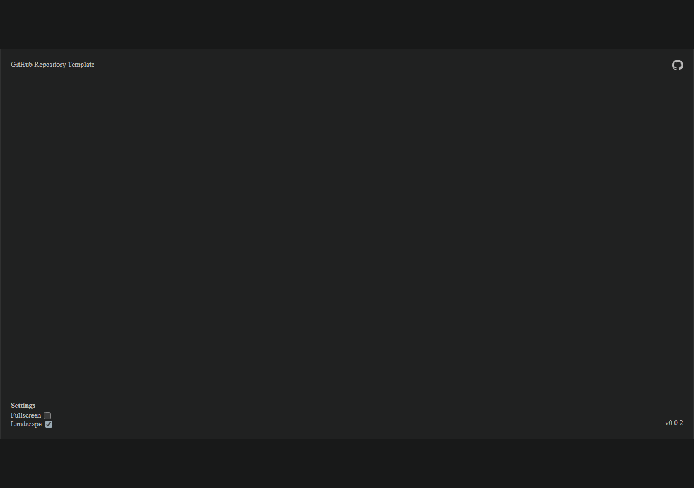
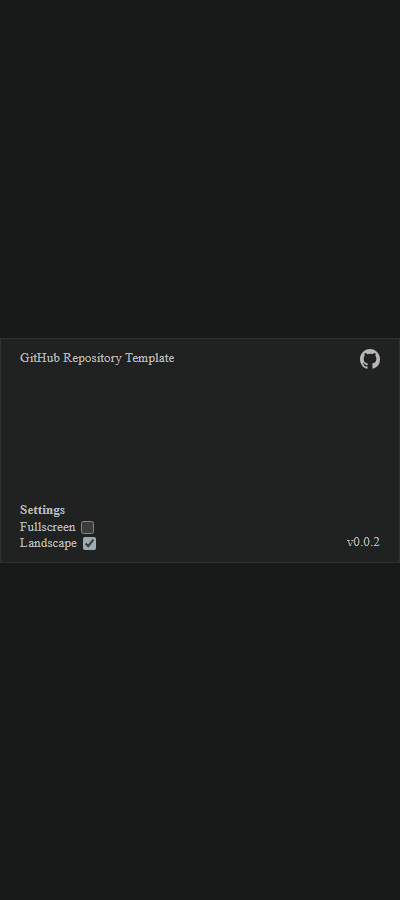

# Layout verification

Verified October 1, 2026 using the running local Vite server and headless Chromium through the bundled Playwright runtime. Changes remain uncommitted for local review.

## Baseline and commands

Before edits, dependencies were absent. `npm ci` installed the existing lockfile dependencies without changing package manifests. After installation, the original page tests (2) and build passed. The full suite had two existing failures in `openspec-skills.test.mjs`: it expects bundled generated skills and corresponding checklist wording, contrary to the repository's current guidance. No skills or unrelated skill tests were changed.

After implementation:

- `node --test project-name/test/page.test.mjs`: 4 passed; orientation/ratio geometry, invalid inputs, root/base configuration, and preserved starter contracts.
- `npm test`: 4 passed, the same 2 unrelated skill-test failures; no additional failures.
- `npm run build`: passed, 19 modules; output under `project-name/dist/` with `/github-repository-template/` asset paths.
- `openspec validate add-changes-to-layout --strict`: passed.

## Browser coverage

An isolated review harness mounted the real `App` with injectable React content and gutter elements, including oversized gutter content. Browser checks covered 36 combinations:

| Variable | Values |
| --- | --- |
| Project ratio/orientation | landscape 16:9, portrait 9:16, square 1:1 |
| Browser CSS size | 1280x900, 400x900, 800x800, 240x160 |
| Device pixel ratio | 1, 1.25, 2 |

Every combination preserved the configured ratio, centered with equal opposing residual space, kept all corners inside the viewport, and made content fill the viewport beneath UI. CSS geometry was identical across DPR values. Content buttons received input through overlay gaps. Oversized gutter content did not push the viewport inward; a gutter button received input in the external region.

The fullscreen control was operable at 240x160 in every orientation and DPR. Fullscreen entry retained the configured ratio; browser-driven exit synchronized the button and stored preference. A rejected fullscreen request was handled with false state. Invalid orientation configuration rendered an actionable alert. The displayed version matched `version.txt`, the repository link retained `noopener noreferrer`, and no canvas or renderer appeared. No page errors were reported.

Screenshots below were captured from the actual default starter rather than the review harness and inspected visually. The default viewport is intentionally empty and accepts future React content; it is not a game demo.

## Contract review

`browser-template-layout`: implemented positive finite ratio/orientation validation, centered CSS fit with resize observation, independently composable external gutters, viewport-owned content/UI, all four reusable corner roles, preserved fullscreen/link/version behavior, and CSS independence from DPR.

`game-integration-guidance`: delivered the mockup and parameter tree, separated Shared/App implementation from future Game responsibilities, documented proposed policies and overrides, all five resolution terms, grid consistency, centered automatic/explicit integer scaling, nonzero fractional fallback, internal letterboxing, physical-pixel limits, lifecycle/camera/filtering/mipmap/anti-aliasing guidance, dynamic scale limits, and future diagnostics. Source comments identify the Babylon Lite seam without importing or executing an engine.

The npm/Vite roots, repository URL, storage key, version source, deployment workflow, dependencies, and release workflow remain compatible. The stale OpenSpec project context was reconciled with the verified implementation. No deployment, release, commit, pull request, or generated skill update was performed. The separate skill-test failures prevent claiming the entire repository test suite is green; they do not prevent reviewing this layout locally.
